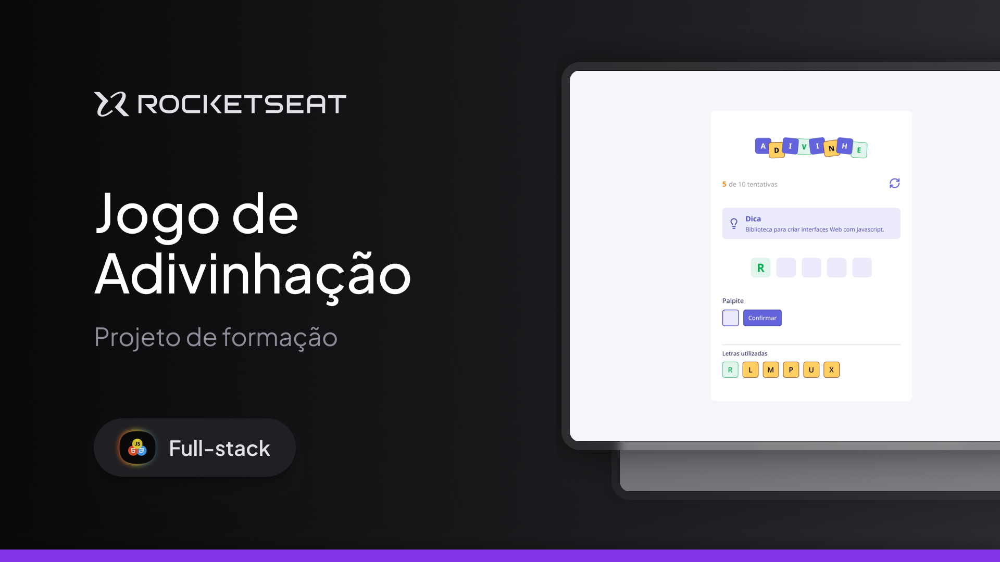

<h1 align="center"> Projeto Adivinhe</h1>

<p align="center">
  <a href="#-tecnologias">Tecnologias</a>&nbsp;&nbsp;&nbsp;|&nbsp;&nbsp;&nbsp;
  <a href="#-projeto">Projeto</a>&nbsp;&nbsp;&nbsp;|&nbsp;&nbsp;&nbsp;
  <a href="#-layout">Layout</a>&nbsp;&nbsp;&nbsp;
  <a href="#-para-executar">Para executar</a>&nbsp;&nbsp;&nbsp;
</p>


<p align="center">
  
</p>


## 🚀 Tecnologias 

Esse projeto foi desenvolvido com as seguintes tecnologias:

- HTML
- CSS
- Javascript / Typescript
- Figma
- React
- Vite

## 💻 Projeto

Esse é um projeto prático da formação Full-Stack e trata-se de um jogo Web para adivinhar palavras com o objetivo de aplicar e consolidar os fundamentos de React.

## 🔖 Layout

Você pode visualizar o layout do projeto através [DESSE LINK](figma.com/community/file/1453366829725330797/jogo-de-adivinhacao). É necessário ter conta no [Figma](https://figma.com) para acessá-lo.

## ✨ Para executar 

Para rodar o projeto no ambiente local siga os seguintes passos:

1. Abra o terminal e navegue até o diretório raiz do projeto.
2. Instale as dependências do projeto executando o comando a seguir:

```bash
  npm install
  # ou
  yarn install
  # ou
  pnpm install
```

3. Após a instalação das dependências, inicie o servidor de desenvolvimento local com o comando:

```bash
  npm run dev
  # ou
  yarn dev
  # ou
  pnpm dev
```

4. Acesse [ http://localhost:5173/](http://localhost:5173/) com o seu navegador para ver o resultado.